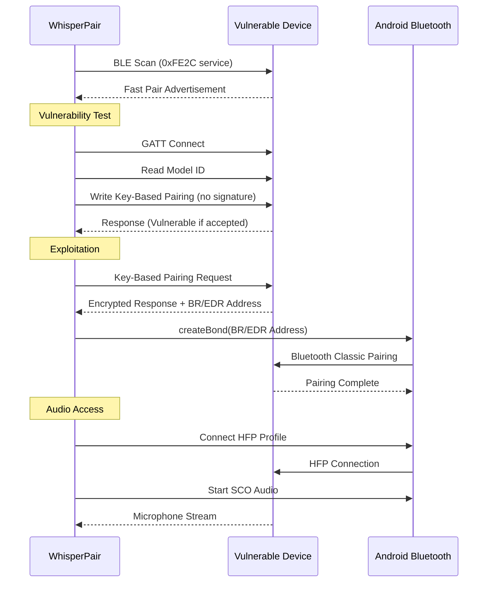
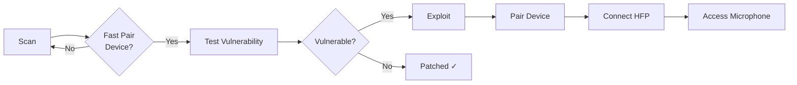

<p align="center">
  
</p>

<h1 align="center">WhisperPair</h1>

<p align="center">
  <strong>CVE-2025-36911 Vulnerability Scanner & Research Tool</strong>
</p>

<p align="center">
  <a href="https://developer.android.com"></a>
  <a href="https://kotlinlang.org"></a>
  <a href="https://www.cve.org/CVERecord?id=CVE-2025-36911"></a>
  <a href="LICENSE"></a>
  <a href="https://whisperpair.eu"></a>
</p>

<p align="center">
  <a href="#features">Features</a> •
  <a href="#installation">Installation</a> •
  <a href="#usage">Usage</a> •
  <a href="#how-it-works">How It Works</a> •
  <a href="#vulnerability">Vulnerability</a> •
  <a href="#credits">Credits</a>
</p>

---

## Overview

**WhisperPair** is a defensive security research tool that demonstrates the CVE-2025-36911 vulnerability in Google's Fast Pair protocol. This vulnerability affects millions of Bluetooth audio devices worldwide, allowing unauthorized pairing and potential microphone access without user consent.

> **Purpose:** Help security researchers, device manufacturers, and end-users identify vulnerable devices that need firmware updates.

## Features

| Feature | Description |
|---------|-------------|
| **BLE Scanner** | Discovers Fast Pair devices broadcasting the 0xFE2C service UUID |
| **Vulnerability Tester** | Non-invasive check if device is patched against CVE-2025-36911 |
| **Exploit Demonstration** | Full proof-of-concept for authorized security testing |
| **HFP Audio Access** | Demonstrates microphone access post-exploitation |
| **Live Listening** | Real-time audio streaming to phone speaker |
| **Recording** | Save captured audio as M4A files |

## Screenshots

<p align="center">
  
  
  
</p>

## Installation

### Requirements
- Android 8.0 (API 26) or higher
- Bluetooth LE support
- Location permission (required for BLE scanning on Android)

### Download
1. Go to [Releases](https://github.com/zalexdev/whisper-pair-app/releases)
2. Download the latest `whisperpair-vX.X.X.apk`
3. Enable "Install from unknown sources" if prompted
4. Install and grant required permissions

### Build from Source
```bash
git clone https://github.com/zalexdev/whisper-pair-app.git
cd whisper-pair-app
./gradlew assembleDebug
```

## Usage

### 1. Scan for Devices
Tap **Scan** to discover nearby Fast Pair devices. Devices in pairing mode will show a "Pairing" badge.

### 2. Test Vulnerability
For devices **not** in pairing mode, tap **Test** to check if they're vulnerable. This is non-invasive and doesn't pair with the device.

| Status | Meaning |
|--------|---------|
| `VULNERABLE` | Device is affected by CVE-2025-36911 |
| `Patched` | Device has been updated with security fix |
| `Error` | Test inconclusive (device may be already paired) |

### 3. Exploit (Authorized Testing Only)
For vulnerable devices, tap **Magic** to demonstrate the full exploit chain:
- Key-Based Pairing bypass
- BR/EDR address extraction
- Bluetooth Classic bonding
- Account Key persistence

### 4. Audio Access
After successful pairing:
1. Tap **Connect Audio (HFP)** to establish Hands-Free Profile
2. Use **Live** for real-time listening through phone speaker
3. Use **Record** to save audio as M4A file

## How It Works



### Attack Flow



## Vulnerability

### CVE-2025-36911: Fast Pair Key-Based Pairing Authentication Bypass

**Severity:** High
**CVSS Score:** 8.1
**Affected:** Google Fast Pair Protocol implementations

#### Technical Details

The Fast Pair protocol uses Key-Based Pairing to authenticate pairing requests. The vulnerability exists because:

1. **Missing Signature Verification:** Many devices accept Key-Based Pairing requests without validating the cryptographic signature
2. **No User Confirmation:** The protocol doesn't require explicit user consent for pairing
3. **Persistent Access:** Attackers can write Account Keys for permanent device tracking

#### Impact

- **Unauthorized Pairing:** Attacker pairs with victim's headphones without consent
- **Microphone Access:** Full access to device microphone via HFP profile
- **Location Tracking:** Persistent tracking via Account Key advertising

#### Affected Devices

See the full list at [whisperpair.eu/vulnerable-devices](https://whisperpair.eu/vulnerable-devices)

Major affected manufacturers include:
- JBL
- Harman Kardon
- Sony (select models)
- Marshall
- And many more...

## Project Structure

```
WhisperPair/
├── app/src/main/java/com/zalexdev/whisperpair/
│   ├── MainActivity.kt          # UI and navigation
│   ├── Scanner.kt                # BLE Fast Pair scanner
│   ├── FastPairDevice.kt         # Device data model
│   ├── VulnerabilityTester.kt    # Non-invasive vuln check
│   ├── FastPairExploit.kt        # PoC exploit implementation
│   └── BluetoothAudioManager.kt  # HFP audio handling
├── app/src/main/res/
│   └── ...                       # UI resources
└── README.md
```

## Credits

### App Developer

This application is an independent implementation created by **[@ZalexDev](https://github.com/zalexdev)** in his own capacity. The original KU Leuven researchers discovered and disclosed the vulnerability but have not released any code and are not affiliated with this project. Their inclusion in credits is solely to acknowledge their research contribution.
### Original Research Team
**KU Leuven, Belgium**

| Researcher | Affiliation |
|------------|-------------|
| [Sayon Duttagupta](https://www.esat.kuleuven.be/cosic/people/person/?u=u0129899)* | COSIC Group |
| [Nikola Antonijević](https://www.esat.kuleuven.be/cosic/people/person/?u=u0148369) | COSIC Group |
| [Bart Preneel](https://homes.esat.kuleuven.be/~preneel/) | COSIC Group |
| [Seppe Wyns](https://seppe.io)* | DistriNet Group |
| [Dave Singelée](https://sites.google.com/site/davesingelee) | DistriNet Group |

*\* Primary authors*

**Funding for the original research:** Flemish Government Cybersecurity Research Program (VOEWICS02)

### Resources
- [WhisperPair Research Paper](https://whisperpair.eu)
- [Demo Video](https://www.youtube.com/watch?v=-j45ShJINtc)
- [COSIC Research Group](https://www.esat.kuleuven.be/cosic)

### Media Coverage
- [WIRED](https://www.wired.com/story/google-fast-pair-bluetooth-audio-accessories-vulnerability-patches/)
- [9to5Google](https://9to5google.com/2026/01/15/google-fast-pair-devices-exploit-whisperpair/)

## Legal Disclaimer

> **This tool is provided for authorized security research and educational purposes only.**

- Only test devices you **own** or have **explicit written permission** to test
- Unauthorized access to computer systems is illegal in most jurisdictions
- The developers are not responsible for misuse of this tool
- This tool is intended to help identify vulnerable devices for remediation

**By using this software, you agree to use it responsibly and in compliance with all applicable laws.**

## See Also

| Tool | Description |
|------|-------------|
| [**Stryker**](https://github.com/Stryker-Defense-Inc/strykerapp) | Comprehensive mobile pentesting toolkit for Android |

## Support Development

If you find WhisperPair useful for your security research:

<a href="https://github.com/zalexdev/whisper-pair-app">
  
</a>

**Crypto Donations:**
```
TRC20 (USDT): TXVt15poW3yTBb7zSdaBRuyFsGCpFyg8CU
```

## License

This project is licensed under the Apache License 2.0 - see the [LICENSE](LICENSE) file for details.

---

<p align="center">
  <sub>Built with ❤️ for the security research community</sub>
</p>
