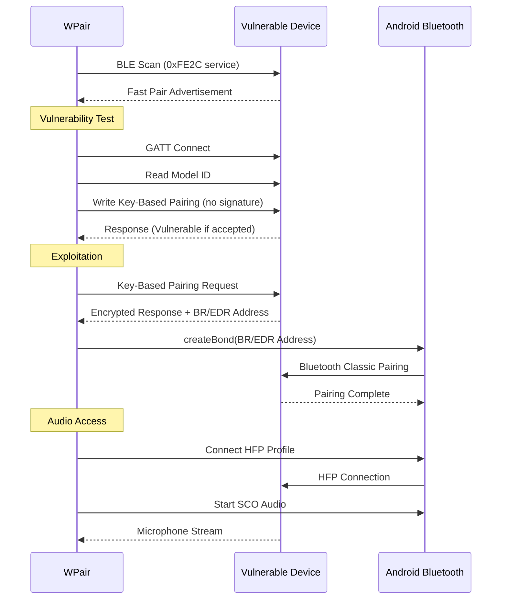

<p align="center">
  
</p>

<h1 align="center">WPair (Root Enhanced Fork)</h1>

<p align="center">
  <strong>CVE-2025-36911 PoC with Root-Based HFP Connection & Magisk Module</strong>
</p>

<p align="center">
  <a href="https://developer.android.com"></a>
  <a href="https://kotlinlang.org"></a>
  <a href="https://www.cve.org/CVERecord?id=CVE-2025-36911"></a>
  <a href="LICENSE"></a>
  
</p>

<p align="center">
  <a href="#whats-new-in-this-fork">What's New</a> •
  <a href="#features">Features</a> •
  <a href="#installation">Installation</a> •
  <a href="#usage">Usage</a> •
  <a href="#how-it-works">How It Works</a> •
  <a href="#credits">Credits</a>
</p>

---

## What's New in This Fork

This fork by **[@k0ssa0](https://github.com/k0ssa0)** adds **root-based automation** to bypass Android's HFP connection restrictions. No more manual Bluetooth Settings!

### New Features

| Feature | Description |
|---------|-------------|
| **🔓 Root HFP Connection** | Connect audio profiles directly without Settings dialog |
| **⚡ Auto-Test on Scan** | Automatically test devices as they're discovered |
| **🎯 Auto-Exploit Vulnerable** | Automatically exploit devices that test vulnerable |
| **🔧 Fix Connection (Root)** | Remove zombie bonds + restart Bluetooth stack |
| **📡 Reconnect All** | Batch reconnect all paired devices with staggered timing |
| **📤 Export Devices** | Share paired device list via system share sheet |
| **🐛 Debug Logs** | In-app root command viewer for troubleshooting |
| **📦 Magisk Module** | Install as privileged system app with auto-permissions |

### Downloads

| File | Description |
|------|-------------|
| [WhisperPair-v1.2.0.apk](releases/WhisperPair-v1.2.0.apk) | Signed release APK (8 MB) |
| [WhisperPair-Magisk-v1.2.0.zip](releases/WhisperPair-Magisk-v1.2.0.zip) | Magisk module (7.6 MB) |

### Root Requirements

This fork requires **root access** (Magisk, KernelSU, etc.) for:
- `pm grant` to set MODIFY_PHONE_STATE, BLUETOOTH_PRIVILEGED
- `cmd bluetooth_manager connect` for direct HFP connection
- `pkill com.android.bluetooth` for stack restart

### Technical Implementation

| Component | Method |
|-----------|--------|
| **Root Execution** | stdin-based `su -c` for Magisk/KernelSU compatibility |
| **HFP Connection** | Multi-strategy: `bluetooth_manager` → BluetoothHeadset API → `btmgmt` fallback |
| **Bond Removal** | Reflection on hidden `BluetoothDevice.removeBond()` method |
| **Stack Restart** | `pkill -9 com.android.bluetooth` triggers system respawn |
| **Permission Grant** | Runtime `pm grant` for BLUETOOTH_PRIVILEGED, MODIFY_PHONE_STATE |

---

## Disclaimer
This application is an independent implementation created by **[@ZalexDev](https://github.com/zalexdev)** in his own capacity. Root enhancements by **[@k0ssa0](https://github.com/k0ssa0)**. The original KU Leuven researchers discovered and disclosed the vulnerability but have not released any code and are not affiliated with this project.

## Overview

**WPair** is a defensive security research tool that demonstrates the CVE-2025-36911 vulnerability in Google's Fast Pair protocol. This vulnerability affects millions of Bluetooth audio devices worldwide, allowing unauthorized pairing and potential microphone access without user consent.

> **Purpose:** Help security researchers, device manufacturers, and end-users identify vulnerable devices that need firmware updates.

## Features

| Feature | Description |
|---------|-------------|
| **BLE Scanner** | Discovers Fast Pair devices broadcasting the 0xFE2C service UUID |
| **Vulnerability Tester** | Non-invasive check if device is patched against CVE-2025-36911 |
| **Exploit Demonstration** | Full proof-of-concept for authorized security testing |
| **HFP Audio Access** | Demonstrates microphone access post-exploitation |
| **Live Listening** | Real-time audio streaming to phone speaker |
| **Recording** | Save captured audio as M4A files |

## Screenshots

<p align="center">
  
  
  
</p>

## Note on Find Hub Network (FMDN) tracking
This tool deliberately does not include FMDN provisioning functionality. While the vulnerability chain technically allows enrolling compromised devices into Google's Find Hub Network for persistent location tracking, I've chosen not to implement this capability. Converting someone's headphones into a covert tracking beacon crosses a clear ethical line from security research into stalkerware territory. The Account Key write and audio access demonstrations are sufficient to prove the vulnerability's severity.

## Installation

### Requirements
- Android 8.0 (API 26) or higher
- Bluetooth LE support
- **Root access** (Magisk, KernelSU, or similar)
- Location permission (required for BLE scanning on Android) / Nearby Devices (A13+)

### Option 1: APK Install (Recommended)
1. Download [WhisperPair-v1.2.0.apk](releases/WhisperPair-v1.2.0.apk)
2. Install and grant root access when prompted
3. Grant Bluetooth and location permissions

### Option 2: Magisk Module (Privileged App)
1. Download [WhisperPair-Magisk-v1.2.0.zip](releases/WhisperPair-Magisk-v1.2.0.zip)
2. Open Magisk → Modules → Install from storage
3. Select the ZIP and reboot
4. App will have system permissions automatically

### Build from Source
```bash
git clone https://github.com/k0ssa0/wpair-app-fixed-perms.git
cd wpair-app-fixed-perms
./gradlew assembleRelease
```

## Usage

### 1. Scan for Devices
Tap **Scan** to discover nearby Fast Pair devices. Devices in pairing mode will show a "Pairing" badge.

### 2. Test Vulnerability
For devices **not** in pairing mode, tap **Test** to check if they're vulnerable. This is non-invasive and doesn't pair with the device.

| Status | Meaning |
|--------|---------|
| `VULNERABLE` | Device is affected by CVE-2025-36911 |
| `Patched` | Device has been updated with security fix |
| `Error` | Test inconclusive (device may be already paired) |

### 3. Exploit (Authorized Testing Only)
For vulnerable devices, tap **Magic** to demonstrate the full exploit chain:
- Key-Based Pairing bypass
- BR/EDR address extraction
- Bluetooth Classic bonding
- Account Key persistence

### 4. Audio Access
After successful pairing:
1. Tap **Connect Audio (HFP)** to establish Hands-Free Profile
2. Use **Live** for real-time listening through phone speaker
3. Use **Record** to save audio as M4A file

## How It Works



### Attack Flow

```mermaid
flowchart LR
    A[Scan] --> B{Fast Pair<br>Device?}
    B -->|Yes| C[Test Vulnerability]
    B -->|No| A
    C --> D{Vulnerable?}
    D -->|Yes| E[Exploit]
    D -->|No| F[Patched ✓]
    E --> G[Pair Device]
    G --> H[Connect HFP]
    H --> I[Access Microphone]
```



## Vulnerability

### CVE-2025-36911: Fast Pair Key-Based Pairing Authentication Bypass (also known as WhisperPair)

**Severity:** High
**CVSS Score:** 8.1
**Affected:** Google Fast Pair Protocol implementations

#### Technical Details

The Fast Pair protocol uses Key-Based Pairing to authenticate pairing requests. The vulnerability exists because:

1. **Missing Signature Verification:** Many devices accept Key-Based Pairing requests without validating the cryptographic signature
2. **No User Confirmation:** The protocol doesn't require explicit user consent for pairing
3. **Persistent Access:** Attackers can write Account Keys for permanent device tracking

#### Impact

- **Unauthorized Pairing:** Attacker pairs with victim's headphones without consent
- **Microphone Access:** Full access to device microphone via HFP profile
- **Location Tracking:** Persistent tracking via Account Key advertising

#### Affected Devices

Major affected manufacturers include:
- JBL
- Harman Kardon
- Sony (select models)
- Marshall
- And many more...

## Project Structure

```
WhisperPair/
├── app/src/main/java/com/zalexdev/whisperpair/
│   ├── MainActivity.kt          # UI and navigation
│   ├── Scanner.kt                # BLE Fast Pair scanner
│   ├── FastPairDevice.kt         # Device data model
│   ├── VulnerabilityTester.kt    # Non-invasive vuln check
│   ├── FastPairExploit.kt        # PoC exploit implementation
│   └── BluetoothAudioManager.kt  # HFP audio handling
├── app/src/main/res/
│   └── ...                       # UI resources
└── README.md
```

## Credits

### App Developer

**[@ZalexDev](https://github.com/zalexdev)**

### Original Research Team
**KU Leuven, Belgium**

| Researcher | Affiliation |
|------------|-------------|
| [Sayon Duttagupta](https://www.esat.kuleuven.be/cosic/people/person/?u=u0129899)* | COSIC Group |
| [Nikola Antonijević](https://www.esat.kuleuven.be/cosic/people/person/?u=u0148369) | COSIC Group |
| [Bart Preneel](https://homes.esat.kuleuven.be/~preneel/) | COSIC Group |
| [Seppe Wyns](https://seppe.io)* | DistriNet Group |
| [Dave Singelée](https://sites.google.com/site/davesingelee) | DistriNet Group |

*\* Primary authors*

**Funding for the original research:** Flemish Government Cybersecurity Research Program (VOEWICS02)

### Resources
- [WhisperPair Research Paper](https://whisperpair.eu)
- [Demo Video](https://www.youtube.com/watch?v=-j45ShJINtc)
- [COSIC Research Group](https://www.esat.kuleuven.be/cosic)

### Media Coverage
- [WIRED](https://www.wired.com/story/google-fast-pair-bluetooth-audio-accessories-vulnerability-patches/)
- [9to5Google](https://9to5google.com/2026/01/15/google-fast-pair-devices-exploit-whisperpair/)

## Legal Disclaimer

> **This tool is provided for authorized security research and educational purposes only.**

- Only test devices you **own** or have **explicit written permission** to test
- Unauthorized access to computer systems is illegal in most jurisdictions
- The developers are not responsible for misuse of this tool
- This tool is intended to help identify vulnerable devices for remediation

**By using this software, you agree to use it responsibly and in compliance with all applicable laws.**

## See Also

| Tool | Description |
|------|-------------|
| [**Stryker**](https://github.com/Stryker-Defense-Inc/strykerapp) | Comprehensive mobile pentesting toolkit for Android |

## Support Development

If you find WhisperPair useful for your security research:

<a href="https://github.com/zalexdev/whisper-pair-app">
  
</a>

**Crypto Donations:**
```
TRC20 (USDT): TXVt15poW3yTBb7zSdaBRuyFsGCpFyg8CU
```

## License

This project is licensed under the Apache License 2.0 - see the [LICENSE](LICENSE) file for details.

---

<p align="center">
  <sub>Built with ❤️ for the security research community</sub>
</p>
